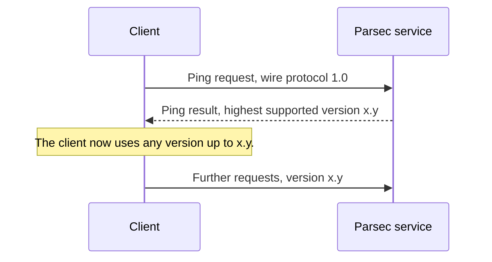

# Wire protocol

The Parsec service and its clients exchange messages over a binary, stream-oriented protocol.
Each request gets exactly one response. Requests travel from the client to the service.
Responses travel back.

The protocol needs a transport that delivers whole messages in order. A Unix domain socket in
streaming mode works. A TCP socket works. Datagram transports do not work.

> [!IMPORTANT]
> Every multi-byte numeric field uses little-endian byte order. The least significant byte
> goes first.

## Header

Requests and responses share one fixed-format header. The header is 36 bytes long. The header
size field carries the value 30, which counts the bytes after the magic number and the header
size field.

Some fields apply to only one direction. Set an unused field to zero.

| Field | Direction | Bytes | Value |
|---|---|---|---|
| Magic number | Both | 4 | Always `0x5EC0A710`. Reject the message if it differs. |
| Header size | Both | 2 | Bytes of header after this field. Currently 30. |
| Major version | Both | 1 | Currently `0x01`. |
| Minor version | Both | 1 | Currently `0x00`. |
| Flags | Both | 2 | Unused. Set to zero. |
| Provider | Both | 1 | Target provider. Zero selects the core provider. |
| Session handle | Both | 8 | Session identifier. |
| Content type | Both | 1 | `0x00` selects a protobuf body. |
| Accept type | Requests | 1 | `0x00` requests a protobuf body in the response. |
| Auth type | Requests | 1 | Tells the service how to read the authentication field. |
| Content length | Both | 4 | Exact byte count of the body. |
| Auth length | Requests | 2 | Exact byte count of the authentication field. |
| Opcode | Both | 4 | The operation to run. |
| Status | Responses | 2 | Zero means success. |
| Reserved | Both | 2 | Unused. Set to zero. |

Read the header size field to decide how many bytes of header to consume. Do not hard-code the
length. The field position and width stay the same across protocol versions. Only the value
changes.

> [!NOTE]
> The wire protocol chapter of the Parsec book gives `0x00` for content type and accept type.
> The API overview chapter of the same book gives `0x01`. The Go reference client sends
> `0x00`. This library sends `0x00`.

## Message layout

A request is a header, then a body, then an authentication field. The three parts are
contiguous. No padding separates them.

The body length must match the content length field. The authentication length must match the
auth length field.

A response is a header, then a body. A response carries no authentication field.

## Version negotiation

The service and the client can run different protocol versions. Use the Ping operation to find
the highest version that the service supports.

If the service does not support the requested version, it returns
`WireProtocolVersionNotSupported`. A response always uses the version of the request that
produced it.

The protocol version does not tell you which operations exist. Use the ListOpcodes operation
to find the operations that one provider supports.

## Authentication

A request carries an authentication field. The auth type header field tells the service how to
read those bytes.

| Auth type | Name | Content of the authentication field |
|---|---|---|
| `0x00` | None | Empty. Use this value for core provider requests. |
| `0x01` | Direct | The application identity, as a UTF-8 string. |
| `0x02` | Authentication tokens | A JWT. The service does not support this value yet. |
| `0x03` | Unix peer credentials | The Unix user identifier, as a little-endian 32-bit unsigned integer. |
| `0x04` | JWT-SVID | A SPIFFE JWT-SVID token in JWS compact serialization. |

The service rejects any other value.

> [!WARNING]
> Do not send authentication bytes with auth type `0x00`. The service ignores them, but the
> combination signals a defect in the client.

An application identity must be unique and stable. The service uses it to separate the stored
assets of one client from another. The identity must survive a system restart.

Core provider operations need no authentication. Those operations report the health and the
configuration of the service. They have no per-client state.

## Providers

A provider is a back-end module that implements operations. One operation runs on one provider.
Set the provider field of the request header to route the request.

The core provider has identifier zero. It always exists. It implements no cryptographic
operation. Query it first to discover the other providers and their identifiers.

Use these core operations to discover the service:

- ListProviders returns the available providers and their characteristics.
- ListOpcodes returns the operations that one provider supports.
- ListAuthenticators returns the supported authentication types.
- CanDoCrypto reports whether a provider accepts a given set of key attributes.

## Service discovery

The default endpoint is the Unix domain socket at `/run/parsec/parsec.sock`. An administrator
can move it.

Read the `PARSEC_SERVICE_ENDPOINT` environment variable to find the endpoint. The variable
holds a URI, as defined in RFC 3986. The URI for the default location is
`unix:/run/parsec/parsec.sock`.

A client library must read this variable without help from the application. The library must
also let the application override the value.

## Key names

A Parsec key name is a UTF-8 string, not a numeric identifier. Names use a path structure, such
as `/keys/rsa/my_key_1`.

Key names live in a per-client namespace. One client cannot enumerate the keys of another
client.

A provider can limit the length of a key name. The protocol defines no fixed maximum. Query the
limit at run time through the capability check mechanism.

## What this library does with it

You do not have to know any of the above to use `Parsec.Client`. This section says where each
part of the protocol shows up, for anyone reading the source or debugging a capture.

| Protocol concern | Where it lives |
|---|---|
| The 36-byte header | `WireHeader`, internal, with `TryWrite` and `TryParse` over `BinaryPrimitives` |
| Framing a request and reading a response | `ParsecRequest`, `ParsecResponse`, `ParsecFrameReader` |
| Version negotiation | <xref:Parsec.Client.ParsecClient.CreateAsync*>, once, at the start |
| The endpoint and `PARSEC_SERVICE_ENDPOINT` | <xref:Parsec.Client.Transport.ParsecEndpoint> |
| Authentication types | <xref:Parsec.Client.Authentication.IParsecAuthentication> and its four implementations |
| Provider routing | The provider a client binds to, chosen once when it is built |
| Statuses | <xref:Parsec.Client.Protocol.ResponseStatus>, turned into exceptions |

The reader takes the header size from the field rather than assuming 36, then reads exactly the
body length the header states. A body larger than
<xref:Parsec.Client.ParsecClientOptions.MaxBodyLength> is refused before it is read, so a
service claiming an enormous answer costs nothing.

An unknown opcode or an unknown status does not raise. The service may add either, and a client
that fell over on a value it did not know would break the moment the service was upgraded ahead
of it. An unknown status becomes a
<xref:Parsec.Client.Errors.ParsecServiceException> carrying the number. An algorithm or a key
type the client does not know is different, and [The error model](error-model.md) says why.
