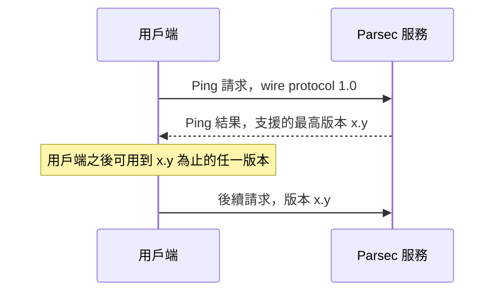

# wire protocol

Parsec 服務與用戶端之間走的是二進位、串流導向的協定。每個請求剛好對應一個回應。請求從用戶端
送往服務，回應反向送回。

這個協定需要一個能依序送達完整訊息的傳輸層。串流模式的 Unix domain socket 可以，TCP socket
可以，datagram 類的傳輸不行。

> [!IMPORTANT]
> 所有多位元組的數值欄位都是 little-endian，最低有效位元組在前。

## 標頭

請求與回應共用一個固定格式的標頭，長度 36 位元組。標頭大小欄位的值是 30，計算的是 magic
number 與標頭大小欄位「之後」的位元組數。

有些欄位只在單一方向有意義，用不到的欄位填零。

| 欄位 | 方向 | 位元組 | 值 |
|---|---|---|---|
| Magic number | 雙向 | 4 | 固定為 `0x5EC0A710`，不符就拒絕整個訊息。 |
| 標頭大小 | 雙向 | 2 | 本欄位之後的標頭位元組數，目前是 30。 |
| 主版本 | 雙向 | 1 | 目前是 `0x01`。 |
| 次版本 | 雙向 | 1 | 目前是 `0x00`。 |
| Flags | 雙向 | 2 | 未使用，填零。 |
| Provider | 雙向 | 1 | 目標 provider，零代表 core provider。 |
| Session handle | 雙向 | 8 | 工作階段識別碼。 |
| Content type | 雙向 | 1 | `0x00` 代表 protobuf 內容。 |
| Accept type | 請求 | 1 | `0x00` 要求回應也用 protobuf。 |
| Auth type | 請求 | 1 | 告訴服務怎麼解讀驗證欄位。 |
| Content length | 雙向 | 4 | 內容的確切位元組數。 |
| Auth length | 請求 | 2 | 驗證欄位的確切位元組數。 |
| Opcode | 雙向 | 4 | 要執行的操作。 |
| Status | 回應 | 2 | 零代表成功。 |
| 保留 | 雙向 | 2 | 未使用，填零。 |

要讀標頭大小欄位來決定消耗多少標頭位元組，不要把長度寫死。這個欄位的位置與寬度跨協定版本
不變，變的只有它的值。

> [!NOTE]
> Parsec book 的 wire protocol 章節寫 content type 與 accept type 是 `0x00`，同一本書的
> API overview 章節寫 `0x01`。Go 參考用戶端送 `0x00`，本程式庫也送 `0x00`。

## 訊息佈局

一個請求是標頭、內容、驗證欄位，三段連續，中間沒有填充。

內容長度必須與 content length 欄位相符，驗證欄位長度必須與 auth length 欄位相符。

一個回應是標頭加內容。回應不帶驗證欄位。

## 版本協商

服務與用戶端可以跑不同的協定版本。用 Ping 操作問出服務支援的最高版本。

服務不支援請求的版本時會回 `WireProtocolVersionNotSupported`。回應一律使用產生它的那個請求
的版本。

協定版本不代表有哪些操作。要知道某個 provider 支援哪些操作，用 ListOpcodes。

## 驗證

請求會帶一個驗證欄位，標頭的 auth type 欄位告訴服務怎麼解讀那些位元組。

| Auth type | 名稱 | 驗證欄位的內容 |
|---|---|---|
| `0x00` | None | 空的。core provider 的請求用這個值。 |
| `0x01` | Direct | 應用程式身分，UTF-8 字串。 |
| `0x02` | Authentication tokens | 一個 JWT。服務目前尚未支援。 |
| `0x03` | Unix peer credentials | Unix 使用者識別碼，little-endian 32 位元無號整數。 |
| `0x04` | JWT-SVID | SPIFFE 的 JWT-SVID，JWS compact serialization 格式。 |

其他值一律被服務拒絕。

> [!WARNING]
> auth type 是 `0x00` 時不要送任何驗證位元組。服務會忽略，但這個組合本身代表用戶端有缺陷。

應用程式身分必須唯一且穩定。服務用它把不同用戶端存放的資產分開，因此這個身分必須在系統重開
之後仍然相同。

core provider 的操作不需要驗證。那些操作回報服務的健康狀態與組態，沒有任何 per-client 狀態。

## Provider

Provider 是實作操作的後端模組。一個操作在一個 provider 上執行，設定請求標頭的 provider 欄位
來決定路由。

core provider 的識別碼是零，一定存在，不實作任何密碼學操作。先問它，才知道其他 provider 與
它們的識別碼。

用下列 core 操作探索服務：

- ListProviders 回傳可用的 provider 與它們的特性。
- ListOpcodes 回傳單一 provider 支援的操作。
- ListAuthenticators 回傳支援的驗證型別。
- CanDoCrypto 回報某個 provider 是否接受一組金鑰屬性。

## 服務探索

預設端點是 Unix domain socket `/run/parsec/parsec.sock`，管理者可以換位置。

讀 `PARSEC_SERVICE_ENDPOINT` 環境變數來找端點。這個變數放的是 RFC 3986 定義的 URI，預設位置
對應的 URI 是 `unix:/run/parsec/parsec.sock`。

用戶端程式庫必須自己讀這個變數，不需要應用程式幫忙，同時也必須讓應用程式能覆寫它。

## 金鑰名稱

Parsec 的金鑰名稱是 UTF-8 字串，不是數字識別碼。名稱使用路徑結構，例如
`/keys/rsa/my_key_1`。

金鑰名稱位於 per-client 的命名空間中，一個用戶端無法列舉另一個用戶端的金鑰。

Provider 可以限制金鑰名稱的長度，協定本身沒有定義固定上限。要知道限制，在執行期透過能力查詢
機制詢問。

## 本程式庫怎麼對應

使用 `Parsec.Client` 不需要知道上面任何一段。這一節寫給讀原始碼或除錯封包的人，說明協定的每
一部分落在哪裡。

| 協定關注點 | 位置 |
|---|---|
| 36 位元組標頭 | `WireHeader`（internal），以 `BinaryPrimitives` 實作 `TryWrite` 與 `TryParse` |
| 請求的框架與回應的讀取 | `ParsecRequest`、`ParsecResponse`、`ParsecFrameReader` |
| 版本協商 | `ParsecClient.CreateAsync`，只在建立時做一次 |
| 端點與 `PARSEC_SERVICE_ENDPOINT` | `ParsecEndpoint` |
| 驗證型別 | `IParsecAuthentication` 與它的四個實作 |
| Provider 路由 | 用戶端建立時選定並綁住的那個 provider |
| 狀態碼 | `ResponseStatus`，轉成例外 |

讀取器從欄位取得標頭大小，不假設 36，然後精確讀取標頭宣稱的內容長度。超過
`ParsecClientOptions.MaxBodyLength` 的內容在讀取之前就被拒絕，所以服務宣稱一個巨大的回應不會
造成任何代價。

未知的 opcode 或未知的狀態碼不會丟例外。服務隨時可能新增，而一個遇到沒見過的值就倒下的用戶端
會在服務比它先升級的那一刻壞掉。未知狀態會變成帶著該數字的 `ParsecServiceException`。未知的
演算法或金鑰型別則不同，[錯誤模型](error-model.md)說明為什麼。
